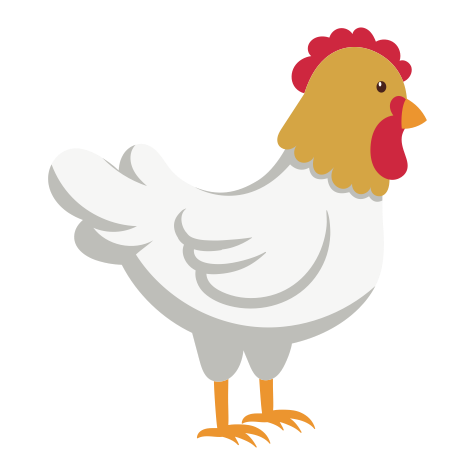

<h1 align="center"> Chicken Facts</h1>

[chickenfacts.io](https://chickenfacts.io) showcases useful and informative chicken facts.

## Functionality

If you visit [chickenfacts.io](https://chickenfacts.io), you'll get a new, random chicken fact. Click `another` to get a new one, or copy the URL to share with friends.

## Technical

The chicken facts were gathered from various sources on the internet. There is a link to the source for each fact.

Imagery was provided by [Vecteezy](https://www.vecteezy.com).

The content is generated with [Jekyll](https://jekyllrb.com) and presented with minimal html, css and javascript. No large libraries or databases are used.

### API

There is an API available. Check out [API.md](./API.md) for details.

## Add a Fact

Chicken facts are accepted via a [pull request](https://github.com/aaronsaray/chickenfacts.io/pulls) and greatly appreciated. Otherwise, just add an [issue](https://github.com/aaronsaray/chickenfacts.io/issues/new/choose).

If you're adding a lot of facts, you might want to use the PHP script located at `bin/add`.  You should be able to run that and insert your facts. It'll create the template.

## What/Who?

This project was created by [Aaron Saray](https://aaronsaray.com). He's not really sure why. Bored I guess.
